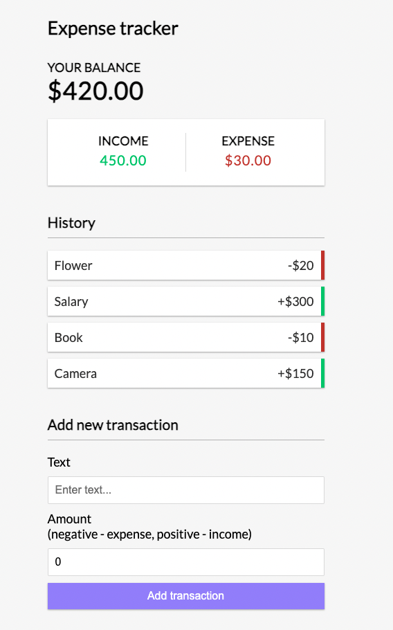

# Expense Tracker

An intuitive and user-friendly expense tracking application built with React. This project helps users monitor and manage their expenses efficiently, ensuring better financial awareness and planning.

## Table of Contents

- [Motivation](#motivation)
- [Features](#features)
- [Technologies Used](#technologies-used)
- [Installation](#installation)
- [Usage](#usage)
- [React Concepts Utilized](#react-concepts-utilized)
- [Screenshots](#screenshots)
- [Future Enhancements](#future-enhancements)
- [Contributing](#contributing)

---

## Motivation

The primary goal of this project is to:

- Help users track their daily, weekly, or monthly expenses.
- Showcase the use of modern React features to build a functional and dynamic application.
- Provide a simple, easy-to-navigate interface for managing personal finances.

## Features

- Add, edit, and delete expense entries.
- Categorize expenses (e.g., Food, Transport, Shopping, etc.).
- View total expenses and breakdown by category.
- Responsive design for desktop and mobile use.

## Technologies Used

- **Frontend**: React (JavaScript, JSX)
- **Styling**: CSS/SCSS or Styled Components (specify what you used)
- **State Management**: React Context API or Redux (mention if used)

## Installation

1. Clone the repository:
   ```bash
   git clone https://github.com/sabyasachisharma/expense-tracker.git
   ```

2. Navigate to the project directory:
   ```bash
   cd expense-tracker
   ```

3. Install dependencies:
   ```bash
   npm install
   ```

4. Start the development server:
   ```bash
   npm start
   ```

5. Open the app in your browser at [http://localhost:3000](http://localhost:3000).

## Usage

1. Launch the app locally by running `npm start`.
2. Add new expenses by clicking the "Add Expense" button.

## React Concepts Utilized

Here are the React features and concepts leveraged in this project:

- **React Functional Components**: Used to build the UI in a modular and reusable way.
- **React Hooks**:
  - `useState` for managing local component state.
  - `useReducer` for managing complex state logic in a scalable way.
- **React Context API**: For global state management across the application.
- **Conditional Rendering**: Displayed different UI elements based on the application state.

## Screenshots

Example:



## Future Enhancements

Here are some ideas for future improvements:

- Integrate a backend API for persistent data storage.
- Add user authentication to allow multiple users to track their expenses.
- Implement data export functionality (e.g., export to CSV or PDF).
- Add advanced analytics features (e.g., trends, predictions).
- Enable dark mode for better accessibility.

## Contributing

Contributions are welcome! Here's how you can help:

1. Fork the repository.
2. Create a new branch (`git checkout -b feature-name`).
3. Make your changes and commit them (`git commit -m 'Add some feature'`).
4. Push to the branch (`git push origin feature-name`).
5. Open a pull request.

---

Feel free to reach out with suggestions or questions. Happy coding!